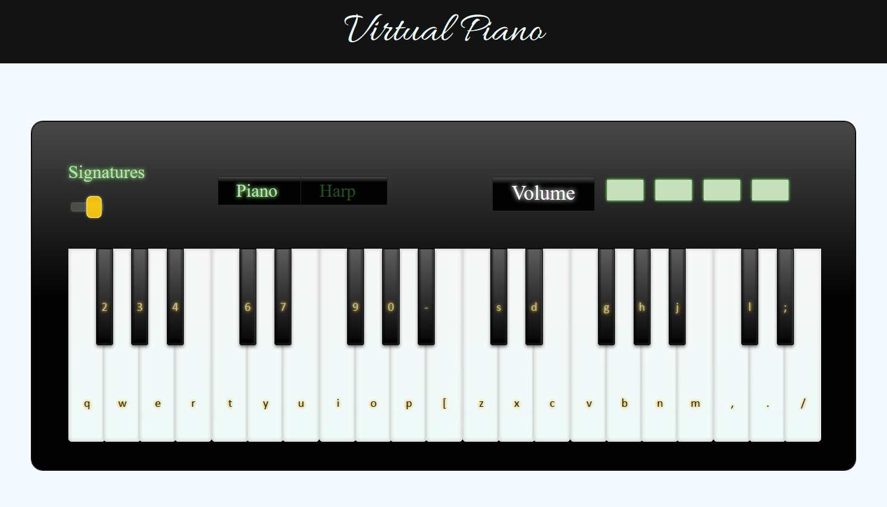

# VirtualPiano



**VirtualPiano** to aplikacja pozwalająca na grę na pianinie za pomocą zwykłej klawiatury, z możliwością przełączania typów granego dźwięku. 

## Instalacja i uruchomienie

* Klonujemy projekt komendą: 

```git
git clone https://github.com/Patrycja20/VirtualPiano.git
```

* Do uruchomienia potrzebujemy środowiska `node.js` oraz `yarn`:
    * Instalator `Node.js` można znaleźć tutaj: [nodejs.org](https://nodejs.org/en/)
    * Aby zainstalować `yarn` globalnie, wpisujemy w konsoli komendę `npm install yarn -g`
    
* Przechodzimy do katalogu z projektem i wykonujemy komendy:

```
yarn install
yarn start
```

* Projekt powinien uruchomić się w przeglądarce pod adresem `localhost:3000`


## Użyte technologie
Projekt został napisany w JavaScript z użyciem następujących technologii:

* _React_ - umożliwił podzielenie aplikacji na mniejsze komponenty (moduły).
* Klasa _Audio_ z JavaScript - umożliwiła załadowanie plików audio i ich odgrywanie


Dźwięki pianina i harfy zostały zgrane z instrumentu klawiszowego _Roland F20_. Następnie, w programie AudaCity, pliki dźwiekowe zostały poprawione - usunięto zakłócenia (szumy), wycięto ciszę, i podzielono je na poszczególne dźwięki.

_______________

# Jak to działa?
Na pianinie możemy grać klikając myszką na klawisze oraz wciskając odpowiednie skróty na klawiaturze. Możemy podejrzeć, jaki klawisz odpowiada danemu dźwiękowi. Wystarczy włączyć przełącznik _Signatures_. 

Pianino umożliwia zmianę dźwięku - do wyboru mamy pianino i harfę. 

Ostatnia kontrolka ustawia głośność pianina. Dostępne są cztery poziomy głośności. 


### Technikalia
Za odgrywanie dźwięków myszką odpowiada komponent `Keyboard`. Po kliknięciu na dany klawisz, wywoływana jest funkcja `play()`. Wczytuje ona ścieżkę do aktualnie wybranego zestawu dźwięków, sprawdza nazwę wciśnięte klawisza, po czym buduje ścieżkę do właściwego pliku dźwiękowego. Na podstawie tej ścieżki tworzony jest obiekt `Audio`, przypisywana jest mu głośność, a następnie jest on odgrywany.

Odgrywanie dźwięków za pomocą skrótów klawiaturowych wygląda podobnie. Dzieje się to w pliku `shortcuts.js`. Plik zawiera mapę klawiszy i dźwięków. Do całego obiektu `document` został podpięty `event listener` na wciśnięcie klawisza. Gdy wciskamy klawisz, jest wywoływana funkcja `handleKeyDown()`, która sprawdza w mapie klawiszy, czy aktualnie wciśnięty odpowiada konkretnemu dźwiękowi. Jeśli tak - sytuacja wygląda analogicznie jak wyżej - pobierana jest ścieżka do odpowiedniego pliku dźwiękowego, jest on ładowany i odgrywany. 

Po załadowaniu aplikacji, w komponencie `App` ładowane są wszystkie dźwięki. Dzięki temu w pamięci przeglądarki są załadowane wszystkie dźwięki, nie ma opóźnień podczas doładowywania ich z serwera.

Z dostępnych opcji nad klawiaturą pianina zapisanych w pliku `Keyboard.js` jest włączenie podglądu skrótów klawiszowych. Po przesunięciu żółtego suwaka w prawo jest wywoływana funkcja `changeSignatures()`. Zmienia ona wartość `signatures` na `true` w `state` komponentu. Zmiana tej wartości przypisuje do pustej tablicy `keys` w `state` skróty klawiszowe. Zmiana wartości suwaka w drugą stronę działa w podobny sposób, lecz wyłącza podgląd.

Kolejną opcją jest przełączanie się użytkownika pomiędzy dźwiękami pianina i harfy. Informacja o aktualnie wybranym dźwięku jest przechowywana w `miniStore.js` w zmiennej `sound`. Do zmiany jej wartości służą dwie funkcje: `setPianoSound()` i `setHarpSound()`. W zależności od wybranego dźwięku jest wywoływana jedna z nich.

Za zmianę poziomu głośności odpowiadają ostatnie górne kontrolki. Dostępne są 4 poziomy głośności: `[0%, 25%, 50%, 100%]`, a aktualny wybrany poziom jest zapisywany w zmiennej `volume` w `state` komponentu `Keyboard` przy użyciu funkcji `onSetVolume`.

## Nazewnictwo dźwięków
Stosujemy oficjalne nazewnictwo dźwięków (podgląd tutaj: [KLIK](https://www.thoughtco.com/thmb/Tji7ttC5XrbulictSXG45hiJAv4=/1550x250/filters:fill(auto,1)/Scientific-Pitch-Notation_large-56a72cde3df78cf7729306a2.png))

/Scientific-Pitch-Notation_large-56a72cde3df78cf7729306a2.png)

Używamy notacji europejskiej, więc zamiast dźwięku **b** jest dźwięk **h**.

Klawiatura umożliwia odegranie poniższych dźwięków:

```
f3
fis3
g3
gis3
a3
ais3
h3
c4
cis4
d4
dis4
e4
f4
fis4
g4
gis4
a4
ais4
h4
c5
cis5
d5
dis5
e5
f5
fis5
g5
gis5
a5
ais5
h5
c6
cis6
d6
dis6
e6
```

Wyjaśnienie:
* c5 - dźwięk c w oktawie nr 5
* cis5 - dźwięk c# w oktawie nr 5

